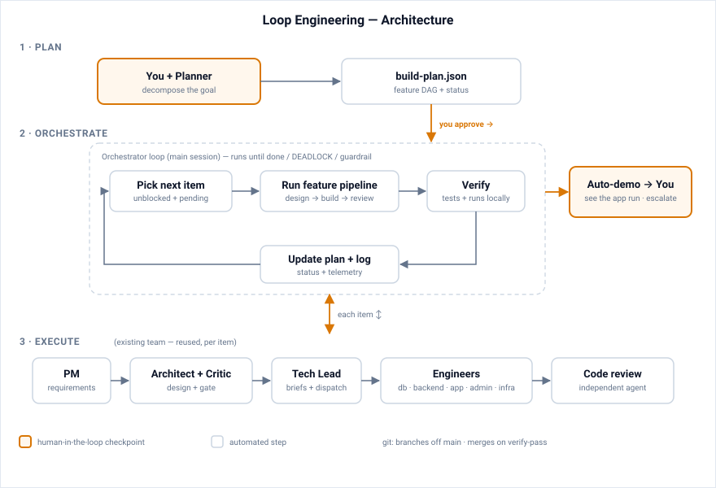
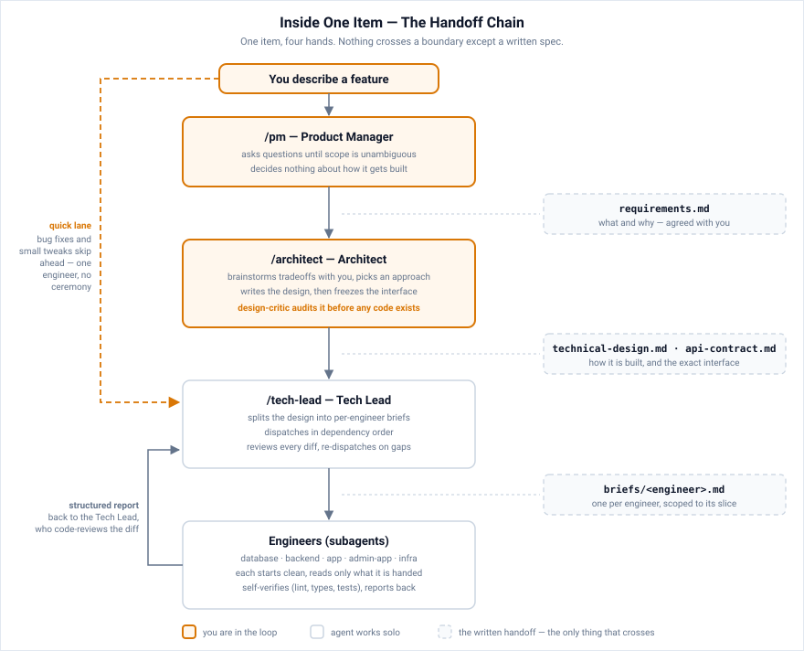

# Chain of Custody

A role-based engineering team for [Claude Code](https://docs.anthropic.com/en/docs/claude-code), where the only thing that crosses between agents is a written spec.

It's a plug-and-play multi-agent setup that splits one Claude session into a full engineering team: Product Manager, Architect, Tech Lead, and specialist engineers, coordinated through slash commands.

Every agent starts in a clean context and gets exactly one written artifact to work from. Requirements first, then a technical design, then an API contract, then a brief. Each role takes possession of the work, signs off, and hands it on. Hence the name: the specs are the paper trail, the handoffs are logged, and you can go back later and see what any role was working from.

## What This Is

A `.claude/` directory you copy into any project. Inside:

- Three operational modes (`/pm`, `/architect`, `/tech-lead`) that switch Claude's persona and workflow
- A build loop (`/planner` + `/orchestrate`) that turns an idea into a dependency-ordered plan and works through it item by item, locally, with human checkpoints
- Specialist engineer subagents (database, backend, app, admin-app, infra) that write code to spec, plus read-only reviewers (design-critic, code-reviewer, security-reviewer) that audit without touching anything
- A development workflow that runs requirements gathering, technical design, design critique, engineer dispatch, code review, and telemetry
- Two quality gates: design-critic before code is written, code review after

It's aimed at solo developers and small teams who want Claude to behave like a disciplined engineering org rather than a freeform assistant.

**Before you start:**

- New to coding, or unsure what half of these words mean? Read [docs/getting-started.md](docs/getting-started.md) for a plain-language walkthrough and keep [GLOSSARY.md](GLOSSARY.md) open in another tab. This README is the reference; getting-started is the on-ramp.
- Starting a brand-new project in an empty folder? Read [Starting from scratch](#starting-from-scratch) first. Greenfield goes straight to `/planner`.
- There's no setup questionnaire. You copy the directory in and start working. The agents write their own project context ([how](#how-the-agents-learn-your-project)), and the only questions you'll get are plain-language ones about your product.
- Operational questions (testing, CI, deploying, teams, non-web projects) live in [docs/faq.md](docs/faq.md).

## Loop Engineering: Building a Whole Idea

If you're building a project from an idea, start here. The loop engineering layer handles a whole idea rather than one feature at a time. The Planner (`/planner`) interviews you and produces a durable, dependency-ordered build plan. The Orchestrator (`/orchestrate`) then works through that plan, designing, building, reviewing, and verifying each item until the plan is done. You choose how often it stops for you, and at every checkpoint it starts your app on your machine and shows you the feature running. Nothing gets deployed.

<p align="center">
  
</p>

Run `/planner` to build the plan, then `/orchestrate` to execute it. Autonomy, budgets, and your local verify/run commands are configured in [`.claude/loop.config.md`](.claude/loop.config.md).

> **Status: V1 (locked design, sequential).** The design note and the adversarial-review rounds behind it are in [.claude/spec/loop-engineering.md](.claude/spec/loop-engineering.md). V1 runs items one at a time with local auto-demo checkpoints. Parallel execution and a dedicated project-scaffold mode are deferred; see §14 of the design. The PM / Architect / Tech-Lead workflow still works standalone for one-off features.

## The Handoff Chain

Band 3 of the diagram above, EXECUTE, is this chain. Both lanes run the same four roles in the same order; what differs is how much of it you're in. Here it is with you driving by hand:

<p align="center">
  
</p>

Every arrow is a file. Each agent starts in a clean context and reads only the artifact it was handed, which is the chain of custody the kit is named for.

Under `/orchestrate` the same chain runs with you out of it, and three things change:

- PM and Architect run on their own, deriving requirements from the plan item's `intent` and `acceptance` instead of interviewing you.
- No `requirements.md` gets written. Requirements pass inline to the design-critic and the engineers, and only the briefs hit disk.
- Review goes to the independent `code-reviewer` agent rather than the Tech Lead's review skill. The Orchestrator wrote the design, the briefs, and the dispatch, so reviewing all that in its own session wouldn't count for much.

Your contact points move up a level: approving the plan, then the auto-demo checkpoint after each item.

Driving the chain by hand is still the right call for one-off work. Use `/pm` for a single feature on an existing project, or go straight to `/tech-lead` for a bug fix, which has a quick lane that dispatches one engineer without the full ceremony.

<details>
<summary>Text version of the diagram</summary>

```
User describes feature
  |
  v
/pm  -->  Gathers requirements via Q&A
  |       Writes docs/features/<slug>/requirements.md
  v
/architect  -->  Brainstorms tradeoffs with user
  |              Writes technical-design.md + api-contract.md
  |              Runs design-critic (catches issues before code)
  v
/tech-lead  -->  Writes per-engineer briefs
  |              Dispatches engineers in dependency order
  |              Runs code review on each engineer's output
  |              Handles escalations and re-dispatch
  v
Engineers (subagents)  -->  Read domain primer + brief + design + contract
                           Implement matching canonical exemplars
                           Self-verify (lint, test)
                           Return structured report (+ primer delta)
```

</details>

## Quick Start

### 1. Copy into your project

```bash
# Clone this repo
git clone https://github.com/smaharj1/chain-of-custody.git /tmp/chain-of-custody
cd /path/to/your/project

# The only required step — everything the modes and the loop read at run time is in .claude/:
cp -r /tmp/chain-of-custody/.claude .

# Optional human docs (also fine to leave in the kit repo and read them there).
# /planner uses choosing-your-stack.md if it's present, and recommends a stack itself if not:
mkdir -p docs
cp /tmp/chain-of-custody/docs/choosing-your-stack.md \
   /tmp/chain-of-custody/docs/getting-started.md \
   /tmp/chain-of-custody/docs/faq.md docs/
```

> ⚠️ **Already using Claude Code in this project?** Then `.claude/` already exists and `cp -r` will merge into it, which can clobber your `settings.json` (permissions, hooks), your `CLAUDE.md`, and any agents or commands you've added. Back it up first (`cp -r .claude .claude.backup`), then merge by hand. The kit's `settings.json` adds two PreToolUse hooks (`guard-git.sh`, `guard-main-edit.sh`) and an empty permission allowlist, so fold those into yours instead of replacing the file, and append the kit's `CLAUDE.md` content to your own.

Then add the kit's runtime artifacts to your project's `.gitignore`:

```gitignore
.claude/metrics.jsonl
.claude/loop.jsonl
.claude/orchestrate.lock
.claude/settings.local.json
.claude/worktrees/
```

`build-plan.json` and `BUILD_PLAN.md` go the other way. They're durable state and should be committed.

Links inside the copied docs to `GLOSSARY.md`, this README, and `examples/` point at the kit repo, so keep your clone around or bookmark the repo page.

You don't fill in any templates. The `.claude/context/` primers arrive as templates and the agents write them; see [How the agents learn your project](#how-the-agents-learn-your-project) below. Go straight to step 3 (`/planner` for a whole project, `/pm` for one feature). Step 2 is optional.

### 2. Customize the agent roster (optional)

The default agents are:

| Agent | File | Purpose |
|---|---|---|
| **Backend Engineer** | `agents/backend-engineer.md` | API endpoints, services, business logic |
| **Database Engineer** | `agents/database-engineer.md` | Schema changes, migrations |
| **App Engineer** | `agents/app-engineer.md` | Main frontend app UI |
| **Admin App Engineer** | `agents/admin-app-engineer.md` | Admin dashboard UI |
| **Infra Engineer** | `agents/infra-engineer.md` | Infrastructure-as-code |
| **Security Reviewer** | `agents/security-reviewer.md` | Security audit before deploy; auto-dispatched in the loop on sensitive items |
| **Design Critic** | `agents/design-critic.md` | Reviews architecture before code |
| **Code Reviewer** | `agents/code-reviewer.md` | Independent diff review in the `/orchestrate` loop (interactive flow uses the code-review Skill) |

**To rename an agent** (say, "app" to "web"): rename the file and update the `name:` in the frontmatter.

**To add a frontend app**: duplicate `agents/app-engineer.md`, rename it (`mobile-app-engineer.md`, for instance), update the frontmatter, and copy `context/app.md` to `.claude/context/mobile-app.md`. Leave that copy as a template; the Tech Lead fills it in before the first dispatch.

**To remove an agent**: delete the file. The Tech Lead works out which engineers are needed from the design doc and won't dispatch agents that don't exist.

### 3. Start using it

```bash
cd /path/to/your/project
claude  # start Claude Code

# To build a whole idea or project (greenfield, or a big batch of work):
> /planner          # interview -> dependency-ordered build-plan.json
> /orchestrate      # runs the plan item by item, local-first, with checkpoints

# For a single feature on an existing project:
> "I want to add user notifications"   # PM mode is the default

# For a small fix:
> /tech-lead
> "Fix the broken pagination on the tasks list page"

# For one-off architecture work:
> /architect
> "Let's design the notification system"
```

## How the Agents Learn Your Project

The agents need real knowledge of your project: the stack, the layering, the conventions, and which file is the gold-standard example to copy. That knowledge lives in the primers (`.claude/context/*.md`), which ship as templates.

Filling them in is the agents' job, not yours. The assumption throughout is that you might not know what an ORM is, which router your app uses, or what a canonical exemplar would even look like, and that you shouldn't have to. Every role that reads a primer will write it first if it's still a template, deriving it from evidence rather than asking you: the code itself on an existing repo, or the stack decisions the Planner walked you through in plain language on a new one. The rules they follow are in [`.claude/context/primer-protocol.md`](.claude/context/primer-protocol.md).

| Primer | Written by | When |
|---|---|---|
| `.claude/CLAUDE.md` | Planner, then the baseline item | Stack table + repo structure, stamped at plan time and again when the skeleton ships |
| `.claude/context/architect.md` | Architect | Before designing (Phase A.0) |
| `.claude/context/backend.md`, `database.md`, `shared-frontend.md`, `app.md`, `admin-app.md`, `infra.md` | Tech Lead, or the Architect | Before an engineer in that domain is dispatched |
| `.claude/context/local-dev.md` | Planner | At plan time. Execution-critical: the run/test/reset commands are proven by running them, not guessed |
| `.claude/loop.config.md` | Planner | At plan time, also execution-critical (`verify_tests` / `verify_run` / `db_ephemeral`) |
| `.claude/context/engineer-protocol.md`, `primer-protocol.md` | Nobody. Generic kit logic | Leave alone |

**How they get read.** There's no auto-loader. Each role's instructions name the exact primer file and the role opens it. Engineers read their domain primer before the brief on every dispatch, since it holds the canonical exemplar they implement against. The Architect reads `architect.md` every session. The design critic and code reviewer read primers as the standard a design or diff is measured against, which is what gives the primers teeth: a primer isn't decoration if a review can cite it.

**How they stay true.** The engineer shipping the code is the first to know a primer has gone stale, because their work is what had to disagree with it. So every report carries a `## Primer Delta` (new pattern established, dead exemplar pointer, convention the codebase has moved off), and review adds `## Primer Staleness` if it finds more. Engineers report; they don't edit. Whichever role is holding the whole picture applies the change in the same session: Tech Lead at wrap-up, the Orchestrator after each item, the Architect for patterns its own design introduced. Same chain of custody as everything else here, with the artifact crossing the boundary rather than the edit. Exemplar pointers get repaired when the file they name moves, and the loop logs `primersUpdated` per item, so a long run of empty deltas across pattern-heavy items shows up as a drift signal instead of passing unnoticed.

**What you will be asked** are plain-language product questions, like "can a regular user see other people's records, or only their own?" Those answers can't be derived from code. Technical calls the agents make themselves and record along with their reasoning, so you can audit them later.

Two consequences worth knowing. A primer section that genuinely can't be known yet, like an exemplar on an empty folder, gets marked `TODO(primer)`, and `/orchestrate` responds by keeping a human checkpoint at every feature until it's resolved. That's deliberate. Missing execution-critical commands are a hard stop instead, since the loop can't verify anything without them.

**Want to read or edit them anyway?** They're plain markdown, and reviewing what the agents wrote about your project is a good use of ten minutes. For calibration on the level of detail, see [`examples/`](examples/README.md), which has every primer filled in for a fictional project called TaskFlow, plus a filled `loop.config.md` and one feature's full artifact chain.

> **`examples/` is documentation, not a demo.** TaskFlow has no code behind it, and the example feature folder was hand-authored to show the shape of the artifacts. It isn't the transcript of a real run. The kit doesn't currently ship a runnable end-to-end demo; see [`examples/README.md`](examples/README.md).

## File Structure

```
.claude/
  CLAUDE.md                          # Project description + conventions (agent-written)
  KIT_VERSION                        # Which kit release this copy came from (see Updating the kit)
  settings.json                      # Claude Code settings (permissions + the two PreToolUse hooks)
  loop.config.md                     # Loop settings: autonomy, budgets, verify commands, db, git
  agents/                            # Engineer subagent definitions
    backend-engineer.md              #   Backend API engineer
    database-engineer.md             #   Database/migration engineer
    app-engineer.md                  #   Main frontend app engineer
    admin-app-engineer.md            #   Admin dashboard engineer
    infra-engineer.md                #   Infrastructure engineer
    security-reviewer.md             #   Security auditor (in-loop gate on sensitive items)
    design-critic.md                 #   Architecture reviewer (pre-code)
    code-reviewer.md                 #   Independent diff reviewer (loop)
  commands/                          # Slash command mode definitions
    pm.md                            #   /pm — requirements gathering
    architect.md                     #   /architect — technical design
    tech-lead.md                     #   /tech-lead — dispatch + review
    planner.md                       #   /planner — whole-idea build plan
    orchestrate.md                   #   /orchestrate — run the plan item by item
  context/                           # Domain primers (project knowledge — agent-written)
    engineer-protocol.md             #   Shared rules for all engineers (generic)
    primer-protocol.md               #   How agents derive + maintain primers (generic)
    architect.md                     #   System architecture primer
    backend.md                       #   Backend patterns primer
    database.md                      #   Schema + migration primer
    shared-frontend.md               #   Shared frontend conventions
    app.md                           #   Main app primer
    admin-app.md                     #   Admin app primer
    infra.md                         #   Infrastructure primer
    local-dev.md                     #   How to run/test/reset the app locally (loop-critical)
  hooks/
    guard-git.sh                     #   PreToolUse(Bash): blocks push/rebase/shared-history git ops
    guard-main-edit.sh               #   PreToolUse(Edit/Write): blocks app-source edits on main
  spec/                              # Runtime specs the modes read (generic)
    loop-engineering.md              #   Authoritative loop spec — orchestrate cites it as governing
  templates/                         # Artifact templates used by PM, Architect, Tech Lead, Planner
    requirements.md                  #   PM writes requirements from this
    technical-design.md              #   Architect writes design from this
    api-contract.md                  #   Architect writes API contract from this
    brief.md                         #   Tech Lead writes engineer briefs from this
    build-plan.md                    #   Planner writes build-plan.json from this
  metrics.jsonl                      # Interactive telemetry (auto-created; gitignore it — see step 1)
  loop.jsonl                         # Loop telemetry (auto-created; gitignore it)
  orchestrate.lock                   # Run lock (auto-created; gitignore it)
build-plan.json                      # Loop plan — canonical state (commit this)
BUILD_PLAN.md                        # Generated human view of the plan (commit this)
docs/                                # What humans read + what the agents write
  choosing-your-stack.md             # Stack defaults by project type (/planner points you here)
  getting-started.md                 # Plain-language on-ramp for non-technical users
  faq.md                             # Operational FAQ (testing, CI, deploy, teams, non-web)
  assets/                            # Diagrams embedded in this README (kit repo only)
  design/
    review-2026-07.md                # Kit's own audit history (kit repo only — don't copy)
  features/
    <feature-slug>/                  # Created per feature (scratch — not long-term)
      requirements.md
      technical-design.md
      api-contract.md
      briefs/<engineer>.md
      reports/<engineer>.md
examples/                            # Writing reference — filled-in docs for a FICTIONAL
                                     #   project (TaskFlow). No code; not a runnable demo.
  README.md                          #   What this folder is and isn't — read first
  CLAUDE.md
  loop.config.md                     #   Filled loop config
  context/                           #   ALL primers filled: architect, backend, database,
                                     #   shared-frontend, app, admin-app, infra, local-dev
  features/csv-export/               #   One feature's artifact chain (requirements → design
                                     #   → contract → brief → report), hand-authored
```

## The Three Lanes

### Loop Lane

For building a project from an idea, or working through a large batch of features.

1. `/planner` — interview, big decisions, dependency-ordered `build-plan.json` (first item = runnable baseline)
2. `/orchestrate` — runs the plan item by item (design → build → review → local demo) until done, with checkpoints

### Full Feature Lane

For a single feature on a project that already exists: significant changes, multi-file refactors.

1. `/pm` — gather requirements, write `requirements.md`
2. `/architect` — design the solution, write `technical-design.md` + `api-contract.md`, run design-critic
3. `/tech-lead` — write briefs, dispatch engineers, run code review, wrap up

### Quick Lane

For small, scoped tasks: bug fixes, single-component tweaks, prop renames.

1. `/tech-lead` — describe the task, it dispatches one engineer directly

The Tech Lead will push back if a "quick" task is actually feature-sized.

## Key Concepts

### Primers vs Feature Folders

- Primers (`.claude/context/*.md`) are long-lived project knowledge, written and kept current by the agents themselves ([how](#how-the-agents-learn-your-project)).
- Feature folders (`docs/features/<slug>/`) are scratch workspaces for one feature. Once the feature ships, the primers and the code are what's canonical, not the feature folder.

### Brief Gaps Are Feedback

When an engineer can't find information they need, they report it as a "brief gap" instead of guessing. These gaps are the most valuable feedback signal the system produces, because they tell the Tech Lead what to include in future briefs.

### Primer Deltas Keep Canon True

Same shape of signal, pointed at the primers. An engineer who had to disagree with a primer to get the work done is the only role that learns it went stale, so every report carries a `## Primer Delta`: a new pattern established, a dead exemplar pointer, a convention the codebase has moved off. The code reviewer adds `## Primer Staleness` if it finds more. Engineers report and never edit. The role holding the whole picture applies the change in the same session, whether that's the Tech Lead at wrap-up or the Orchestrator after each item. A stale primer is never grounds for blocking correct code; the code wins and the primer gets fixed.

### The Design Critic

Before any code is written, the Architect runs a design-critic subagent that looks for blockers: missing error cases, schema issues, contract ambiguities, security gaps. A bug caught here costs minutes. The same bug caught after implementation costs hours.

### Telemetry

After every feature or task, the Tech Lead appends a JSON line to `.claude/metrics.jsonl` with timing, iteration counts, and brief gaps. Read it occasionally to tune your workflow.

## Customization Guide

### Which files hold your project context (agent-written — review, don't author)

- `.claude/CLAUDE.md` and `.claude/context/*.md` (except the two protocol files). The agents write these and keep them current ([how](#how-the-agents-learn-your-project)). Correct them freely when you know better; you're never expected to author them.

### Which files to leave alone (generic workflow logic)

- `.claude/agents/*.md` — work as-is for most projects
- `.claude/commands/*.md` — work as-is (the PM/Architect/Tech Lead workflow)
- `.claude/context/engineer-protocol.md` — generic rules for all engineers
- `.claude/context/primer-protocol.md` — how agents derive + maintain primers
- `.claude/spec/*.md` — the authoritative loop spec; `/orchestrate` treats it as governing
- `.claude/hooks/*.sh` — the two PreToolUse guards
- `.claude/templates/*.md` — you *can* edit these if your workflow differs, but they're in the never-edit set below, so a kit update overwrites them. Keep a note of your changes if you customize.

### Tuning for your project

- **No admin app?** Delete `agents/admin-app-engineer.md` and `context/admin-app.md`.
- **Multiple frontend apps?** Duplicate `agents/app-engineer.md` and `context/app.md` for each.
- **No infrastructure?** Delete `agents/infra-engineer.md` and `context/infra.md`.
- **No frontend at all (API service, CLI tool)?** Delete the app agents and `context/shared-frontend.md`. The Tech Lead's Backend→frontend dispatch gate simply never fires, and the api-contract template becomes your interface contract. More in [docs/faq.md](docs/faq.md).
- **Mobile app?** Duplicate `agents/app-engineer.md` and adjust `context/app.md` for React Native or similar. Note that the loop's auto-demo has no simulator screenshot, so mobile demo targets fall back to endpoint/test assertions ([docs/faq.md](docs/faq.md)).
- **Different backend language?** The agents are language-agnostic and derive `context/backend.md` from whatever is in the repo.
- **Want a UI designer agent?** Create `agents/ui-designer.md` following the pattern of the existing agents.

## Starting from Scratch

This kit was built to coordinate work on a project that already exists, where engineers "match the canonical exemplar," an existing file showing the established pattern. On an empty folder there are no exemplars yet, which is exactly why greenfield starts with `/planner` instead of `/pm`:

1. **`/planner` makes a runnable skeleton the mandatory first item.** Its greenfield rule requires the first plan item to be "a locally-runnable app + test harness + one passing smoke test." `/orchestrate` builds that item first, so you never scaffold the project by hand.
2. **That first item is foundational.** It establishes the patterns (folder layout, error handling, naming) that every later item copies, and it's the newest, least-exemplar-supported part of the run, so give it more of your attention than the rest.
3. **After it ships**, the Orchestrator points the `context/*.md` primers at those files as the canonical exemplars, which is the primer-delta step at the end of every item. The normal exemplar-matching workflow applies from then on. Until that point those sections sit marked `TODO(primer)`, since you can't name an exemplar before it exists.

The kit ships a bootstrap safety floor so the empty-folder path works without manual setup. `/orchestrate`'s preamble runs `git init` if there's no repository, the Planner writes the primers plus the verify commands in `.claude/loop.config.md` and `local-dev.md` as plan outputs (nothing to pre-fill), and the Tech Lead's engineer-set detection has an explicit scaffold row where the Backend engineer owns the skeleton. The first item also stamps `CLAUDE.md`'s stack table so the loop's autonomy check passes on later runs.

### It's two commands, not one

`/planner` interviews and writes; it doesn't build. It recommends the technical choices rather than asking you to make them, produces the plan, the primers, and the config, then ends by telling you to switch. You type `/orchestrate` yourself, and that's the role that runs [the handoff chain](#the-handoff-chain) once per plan item. The Planner never dispatches anyone.

Here's what still needs you, so none of it comes as a surprise:

| Moment | Why it can't be automated |
|---|---|
| **Checkpoints** | Default `autonomy: per-milestone` starts your app locally and shows you the working feature, then waits for a yes. Set `per-feature` in `.claude/loop.config.md` to see every item. |
| **Secrets** | An item needing a payment or email API key hard-stops and asks. No agent can derive a credential from your code. |
| **Security blocks** | A Critical/High finding won't merge past you. You either fix it or record an explicit waiver with justification. |
| **Plain-language product questions** | "Can a regular user see other people's records, or only their own?" The answers aren't in any codebase. |
| **Item one** | The skeleton every later item copies, with no exemplar behind it yet. If it looks wrong, say so then, not ten items later. |

> A dedicated bootstrap *mode* that further hardens this first-item experience is still on the roadmap (design §14). Until then, `/planner` → `/orchestrate` is the path, with extra human attention on item one.

New to all of this? [docs/getting-started.md](docs/getting-started.md) walks through the whole thing in plain language.

## Prerequisites

**Required**

- [Claude Code](https://docs.anthropic.com/en/docs/claude-code) CLI installed and authenticated. Feature floor: agent frontmatter (`.claude/agents/`), PreToolUse hooks with `$CLAUDE_PROJECT_DIR`, and the Skill tool. Any recent version has all three.
- `git`. The loop's branch/merge/verify machinery assumes a repository; the orchestrate preamble runs `git init` for you on an empty folder.
- `python3` on PATH, since both guard hooks use it. Without it they announce themselves inactive and allow everything (fail-open by design), so the git guardrails silently vanish.
- **Permission setup for long loop runs.** Claude Code asks before running commands it hasn't been allowed, and that pause is independent of the loop's autonomy dial — a `per-milestone` or `unattended` `/orchestrate` run will stall at the first un-allowlisted command. The kit ships an empty allowlist (`.claude/settings.json` → `permissions.allow`) on purpose; before a long run, allowlist your project's run/test/build commands there (ask Claude to do it, or accept the prompts as they come — the Planner offers to set this up as part of the plan). For interactive feature work the prompts are normal and fine.
- A project to work on, in any language or framework. An empty folder also works; see [Starting from scratch](#starting-from-scratch).

**Recommended**

- **context7 MCP** for fresh library docs. ⚠️ *Install-name trap*: the agent files wire the tool names for a **plugin** install named `context7` (`mcp__plugin_context7_context7__*`). Install it as a plain MCP server instead and the tools are named `mcp__context7__*`, so you'd need to update the `tools:` line in the eight agent files to match. Otherwise the docs capability silently disappears while the engineer protocol still mandates it.
- **superpowers plugin** (`superpowers:brainstorming`), used by `/pm` and `/planner` for exploratory interviews. Both fall back gracefully without it.
- **code-review plugin** (`code-review:code-review`), the interactive Tech Lead's review skill. A manual-review fallback is built in.

**Optional (text fallbacks built in)**

- A browser-preview MCP for the loop's auto-demo screenshots, and a push-notification capability for checkpoint alerts. Without either, the loop presents demo routes and HTTP checks as text and uses transcript banners.

## Updating the Kit

Your copy records its release in `.claude/KIT_VERSION`, and changes ship in [CHANGELOG.md](CHANGELOG.md). To update:

1. Check your `.claude/KIT_VERSION` and read the CHANGELOG entries since.
2. **Re-copy the never-edit set** from the new kit release. These are kit logic and safe to overwrite: `.claude/agents/*` (unless you added or renamed agents), `.claude/commands/*`, `.claude/context/engineer-protocol.md`, `.claude/context/primer-protocol.md`, `.claude/hooks/*`, `.claude/templates/*`, `.claude/spec/*`, and `.claude/KIT_VERSION` itself.
3. **Never overwrite the project-specific set.** These describe *your* project. The agents wrote them, but they're still yours, and the kit's copies are empty templates: `.claude/CLAUDE.md`, `.claude/context/*` primers (except the two protocol files), `.claude/loop.config.md`, `.claude/settings.json`. If a CHANGELOG entry touches one of these, say a new settings hook, apply it as a hand-merge.

## License

MIT — see [LICENSE](LICENSE).
